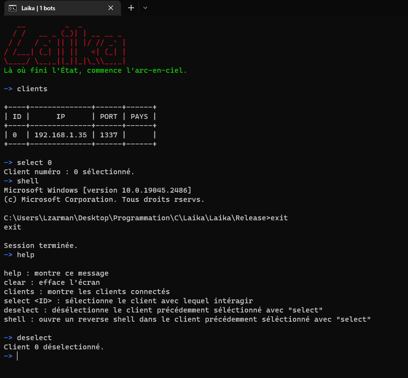

# Laika

# Agent

## Features :
* Reverse shell
* File explorer (download/upload/remove)
* Shellcode injection (TODO)

## Caractéristiques
* Petit (7ko)
* Fait en C, sans CRT
* x32 bit
* Modulaire (peut se déployer via shellcode/dll/pe injection/.exe)
* Trafic chiffré
* API resolve de manière dynamique
* Reconnect en cas de plantage serv/autre
* Liste de serveurs de fallback
* FUD

TODO

* x64bit support
* Custom sleep
* File explorer (upload/download)
* Shellcode injection pour x64/x32 bits process

# Server

* Fait en Python
* Permet de build le client/faire la config
* File explorer (upload/download)

TODO

* Ajouter un crypteur/dropper
* Fix l'input qui bloque l'arrivée de données (reproductible avec une session powershell)

# Crypter

En WIP.

TODO

* Ajouter du code mutation
* Control flow flattening
* Anti-disassembly

