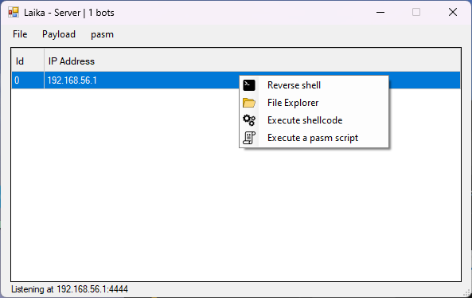
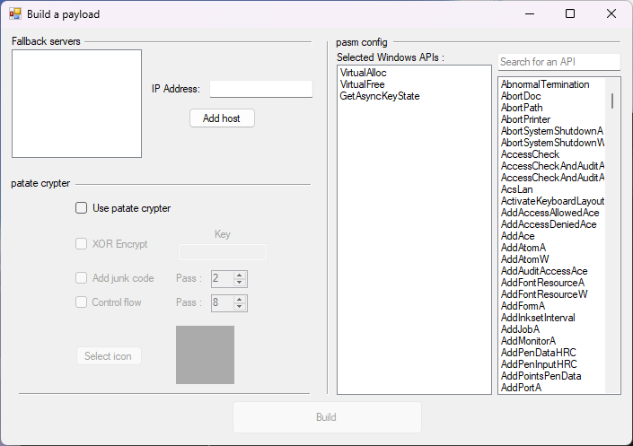

# Laika

A very simple RAT I created for fun. 

# Agent

## Features :
* Reverse shell
* File explorer (download/upload/remove/execute)
* Shellcode execution
* Server builder supports [patate-crypter](https://github.com/ALittlePatate/patate-crypter) inetgration
* [pasm](https://github.com/ALittlePatate/patate-crypter) integration in the agent

## Characteristics
* Small (26ko)
* Made in C, no CRT
* x32 bit
* Dynamic API resolving
* Multiple fallback servers
* FUD

TODO

* x64bit support
* Custom sleep
* Shellcode injection cross architecture

# Server

* Made with Windows Forms (C#)
* Can build the client
* File explorer GUI (upload/download/remove/execute)
* Remote shell GUI
* PASM code editor

TODO

* Dark theme
* colors in IDE
* lines number in IDE
* close warning in IDE
* Plugins support

# Screenshots

